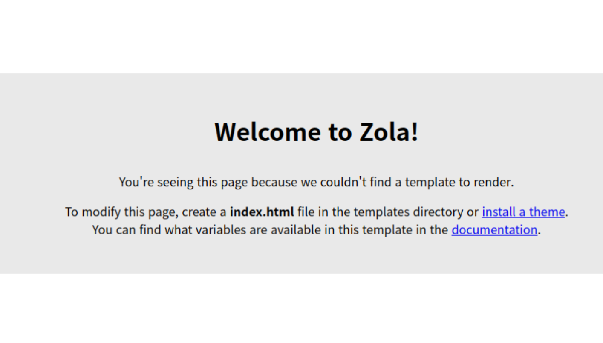

+++
title = "블로그 만들기"
draft = false

[taxonomies]
categories = ["web"]
tags = ["web", "blog", "zola", "SSG"]
authors = ["ceo"]
+++
회사를 창업하면서 바쁘다는 이유로 혹은 게을러서 회사 블로그를 만드는 것을 미루고 있었다.

일단 어떻게 만들어야 하나 고민이었다. 아주 오래전에 간단한 개인 블로그를 처음부터 코딩해서 만들어 본적은 있다. 그렇지만 현 시대에 굳이 그렇게 할 필요성을 느끼지는 못해서 잘 만들어진 블로그 엔진을 찾아서 이용하기로 하였다.
<!-- more -->

### Static vs. Dynamic sites

블로그 기능을 제공하는 많은 서비스들이 있지만 단독으로 회사 홈페이지 웹서버에 같이 돌아가게 하는 것이 좋겠다고 생각했다. 이른바 Static site generator를 쓰자였다.
블로그 글이나 문서 페이지 같은 사이트들은 동적이지 않아도 괜찮기 때문이다.

정적 사이트의 장점은 빠르다는 것이다. 데이터베이스가 필요한 사이트라면 데이터베이스에 접근하기 위한 오버헤드가 발생할 수 밖에 없다.
물론 온라인 스토어와 같은 사이트라면 당연히 동적인 사이트가 필요할 것이다.

내가 필요한 것은 블로그 글을 올릴 수 있는 간단한 블로그 엔진이었다.
필요한 것은 Markdown으로 작성할 수 있었으면 좋겠다는 것이었다. 아무래도 개발자에게는 가장 익숙한 문서 포맷일 것이다.

### 블로그 엔진 찾기

Static site generator라고 하면 [Jekyll](https://github.com/jekyll/jekyll)이 떠올랐다. [GitHub Pages](https://github.com/jekyll/jekyll)로 정적 사이트를 만들 때 많이 쓰는 것으로 알고 있었다.

그렇지만 뭔가 새로운 것으로 찾아보기로 하였다. 가장 기본적인 선정 기준은 나에게 가장 익숙한 언어로 개발된 블로그 엔진이었으면 한다는 것이었다.
내가 가장 좋아하는 언어인 Rust는 아직까지는 우리나라에서는 상당히 마이너한 언어인 것 같다.

가장 많이 사용되는 Rust로 개발된 블로그 엔진이 무엇인지 알기 위해서 [awesome-rust](https://github.com/rust-unofficial/awesome-rust)를 방문하였다.
많지 않은 수의 프로젝트들이 있었는데 그중에서 가장 활발하게 개발되고 잘 관리되는 프로젝트를 찾았고 그것은 [zola](https://www.getzola.org/)였다.

### zola 설치

특이하게도 rust로 개발된 프로젝트이지만 [crates.io](https://crates.io/)에 올라가 있지 않아서 단순히 `carge install zola` 명령으로 설치할 수 없었다.
물론 다양한 플랫폼 별로 패키지 매니저들을 통해서 설치 가능하기 때문에 설치에 어려움은 없을 것 같다.

나는 가장 원초적으로 소스에서 빌드해서 설치하는 방법을 이용했다. cargo가 있기 때문에 아주 간단하다.

```bash
$ git clone https://github.com/getzola/zola.git
$ cd zola
$ cargo install --path . --locked
```

이렇게 하면 바이너리 파일이 `~/.cargo/bin/zola` 위치에 생성된다.

### 블로그 생성

zola는 CLI로 쉽게 사용하도록 되어 있다.

```bash
$ zola init muon-blog
Welcome to Zola!
Please answer a few questions to get started quickly.
Any choices made can be changed by modifying the `config.toml` file later.
> What is the URL of your site? (https://example.com): https://blog.muon.co 
> Do you want to enable Sass compilation? [Y/n]: 
> Do you want to enable syntax highlighting? [y/N]: y
> Do you want to build a search index of the content? [y/N]: y

Done! Your site was created in /home/mewlips/github/muoncorp/muon-blog

Get started by moving into the directory and using the built-in server: `zola serve`
Visit https://www.getzola.org for the full documentation.
$ cd muon-blog
$ tree
├── config.toml
├── content
├── sass
├── static
├── templates
└── themes
```

새로운 빈 껍데기 블로그 사이트가 만들 준비가 되었다.

```bash
$ zola serve
Building site...
Checking all internal links with anchors.
> Successfully checked 0 internal link(s) with anchors.
-> Creating 0 pages (0 orphan) and 0 sections
Done in 19ms.

Listening for changes in /home/mewlips/github/muoncorp/muon-blog/{config.toml,content,sass,static,templates}
Press Ctrl+C to stop

Web server is available at http://127.0.0.1:1111
```

웹 브라우저로 접속을 해보면 아래 그림과 같이 보이게 된다.



### 맺음말

이제부터는 [Getting Started](https://www.getzola.org/documentation/getting-started/overview/) 문서를 보면서 따라해보면 된다.
